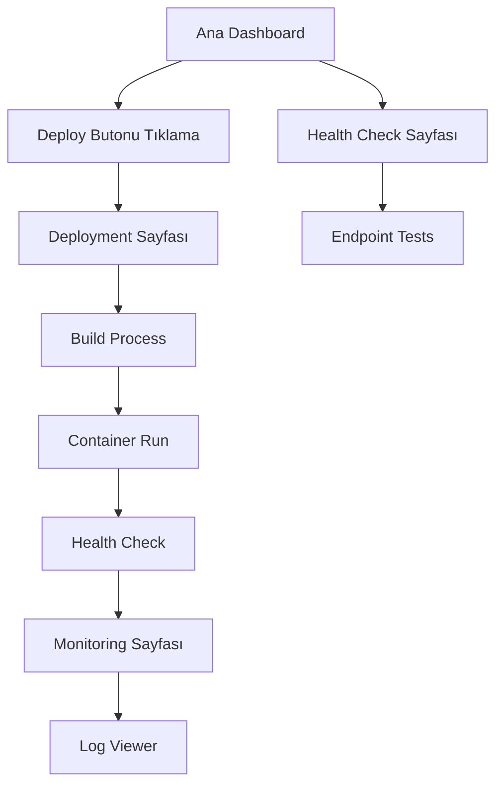

# Cloud Deployment Automation Dashboard - Ürün Gereksinimleri Dokümanı

## 1. Ürün Genel Bakış
DevOps süreçlerini otomatikleştiren ve izleyen web tabanlı bir dashboard uygulaması. Kullanıcılar tek tıkla uygulama deployment'ı yapabilir, container durumunu izleyebilir ve sistem loglarını görüntüleyebilir.

Bu proje, Sufle DevOps mülakat sürecinde Python/Flask, Docker, CI/CD, cloud deployment ve infrastructure monitoring yetkinliklerini göstermek için tasarlanmıştır. Gerçek dünya DevOps pipeline'larının mini bir simülasyonunu sunar.

## 2. Temel Özellikler

### 2.1 Kullanıcı Rolleri
Bu projede tek kullanıcı rolü bulunmaktadır - herhangi bir authentication gerektirmez.

| Rol | Kayıt Yöntemi | Temel Yetkiler |
|-----|---------------|----------------|
| DevOps Engineer | Doğrudan erişim | Tüm deployment ve monitoring işlemlerini gerçekleştirebilir |

### 2.2 Özellik Modülü
Cloud Deployment Dashboard aşağıdaki ana sayfalardan oluşur:

1. **Ana Dashboard**: Deployment butonu, sistem durumu, container status gösterimi
2. **Deployment Sayfası**: Build süreci takibi, deployment logları, real-time status
3. **Monitoring Sayfası**: Container health check, sistem metrikleri, log görüntüleme
4. **Health Check Sayfası**: Endpoint testleri, connectivity kontrolü

### 2.3 Sayfa Detayları

| Sayfa Adı | Modül Adı | Özellik Açıklaması |
|-----------|-----------|-------------------|
| Ana Dashboard | Deployment Control | Deploy butonu ile tek tıkla deployment başlatma |
| Ana Dashboard | Status Overview | Container durumu, son deployment bilgisi, sistem health özeti |
| Ana Dashboard | Quick Actions | Hızlı restart, stop, health check butonları |
| Deployment Sayfası | Build Process | Docker image build süreci real-time takibi |
| Deployment Sayfası | Deployment Logs | Bash script çıktıları, deployment adımları logları |
| Deployment Sayfası | Progress Tracking | Build → Run → Health Check aşamalarının görsel takibi |
| Monitoring Sayfası | Container Status | Running containers listesi, resource kullanımı |
| Monitoring Sayfası | Log Viewer | Container logları real-time görüntüleme, filtreleme |
| Monitoring Sayfası | System Metrics | CPU, memory, disk kullanımı gösterimi |
| Health Check Sayfası | Endpoint Testing | HTTP health check endpoint'leri test etme |
| Health Check Sayfası | Connectivity Tests | Ping, curl testleri ile bağlantı kontrolü |
| Health Check Sayfası | Service Status | Tüm servislerin durumu tek ekranda görüntüleme |

## 3. Temel Süreç

**Ana Kullanıcı Akışı:**
1. Kullanıcı ana dashboard'a erişir
2. "Deploy" butonuna tıklar
3. Sistem otomatik olarak Docker image build eder
4. Container ayağa kaldırılır
5. Health check yapılır ve sonuç gösterilir
6. Kullanıcı monitoring sayfasından logları ve metrikleri izleyebilir
7. Health check sayfasından endpoint testleri yapabilir

## 4. Kullanıcı Arayüzü Tasarımı

### 4.1 Tasarım Stili
- **Ana Renkler**: Bootstrap primary (#007bff), success (#28a745), danger (#dc3545)
- **İkincil Renkler**: Light gray (#f8f9fa), dark (#343a40)
- **Buton Stili**: Bootstrap rounded butonlar, hover efektleri
- **Font**: System font stack (Segoe UI, Roboto, sans-serif), 14px-16px ana boyut
- **Layout**: Card-based tasarım, responsive grid sistem
- **İkonlar**: Bootstrap Icons, Font Awesome icons

### 4.2 Sayfa Tasarım Genel Bakış

| Sayfa Adı | Modül Adı | UI Elementleri |
|-----------|-----------|----------------|
| Ana Dashboard | Deployment Control | Büyük yeşil "Deploy" butonu, progress bar, status badges |
| Ana Dashboard | Status Overview | Info cards, color-coded status indicators, last deployment timestamp |
| Deployment Sayfası | Build Process | Real-time console output, progress steps, loading spinners |
| Deployment Sayfası | Deployment Logs | Scrollable log container, syntax highlighting, timestamp |
| Monitoring Sayfası | Container Status | Table view, status badges, action buttons |
| Monitoring Sayfası | Log Viewer | Live log stream, search/filter controls, auto-scroll toggle |
| Health Check Sayfası | Endpoint Testing | URL input, test buttons, response display, status codes |

### 4.3 Responsive Tasarım
Desktop-first yaklaşım ile tasarlanmış, tablet ve mobil cihazlarda da kullanılabilir. Touch interaction optimizasyonu dahil edilmiştir. Bootstrap grid sistemi kullanılarak responsive layout sağlanır.