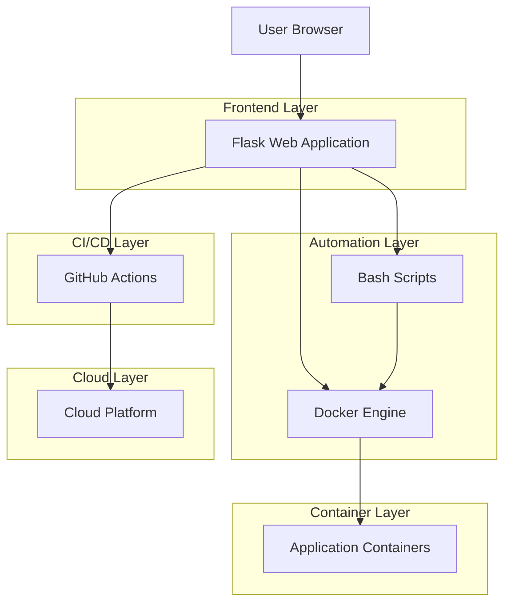
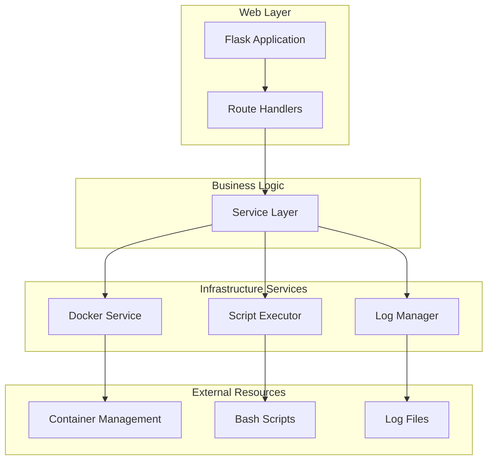
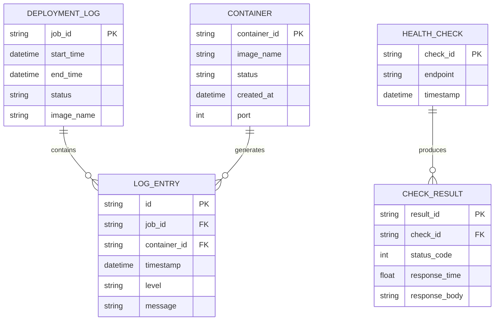

# Cloud Deployment Automation Dashboard - Teknik Mimari Dokümanı

## 1. Mimari Tasarım



## 2. Teknoloji Açıklaması

- **Frontend**: Flask@2.3 + Bootstrap@5.3 + Jinja2 templates
- **Backend**: Python@3.11 + Flask + subprocess (bash script execution)
- **Containerization**: Docker + Docker Compose
- **Automation**: Bash scripting + Python subprocess
- **CI/CD**: GitHub Actions
- **Cloud**: Render.com / Fly.io (deployment target)

## 3. Route Tanımları

| Route | Amaç |
|-------|------|
| / | Ana dashboard sayfası, deployment kontrolü ve sistem durumu |
| /deploy | Deployment işlemini başlatır, real-time progress gösterir |
| /monitoring | Container durumu, loglar ve sistem metrikleri |
| /health | Health check endpoint'leri ve connectivity testleri |
| /api/deploy | AJAX deployment trigger endpoint |
| /api/status | Container ve sistem durumu JSON API |
| /api/logs | Real-time log streaming endpoint |
| /api/health-check | Health check sonuçları JSON API |

## 4. API Tanımları

### 4.1 Core API

**Deployment işlemi başlatma**
```
POST /api/deploy
```

Request:
| Param Name | Param Type | isRequired | Description |
|------------|------------|------------|-------------|
| action | string | true | Deploy action type: "build", "run", "restart" |
| image_name | string | false | Docker image name (default: "sufle-demo") |

Response:
| Param Name | Param Type | Description |
|------------|------------|-------------|
| status | boolean | Deployment başlatma durumu |
| job_id | string | Deployment job identifier |
| message | string | İşlem durumu mesajı |

Example:
```json
{
  "action": "build",
  "image_name": "sufle-demo:latest"
}
```

**Sistem durumu sorgulama**
```
GET /api/status
```

Response:
| Param Name | Param Type | Description |
|------------|------------|-------------|
| containers | array | Running container listesi |
| last_deployment | object | Son deployment bilgileri |
| system_health | object | Sistem sağlık durumu |

**Log streaming**
```
GET /api/logs?container_id={id}&lines={count}
```

Request:
| Param Name | Param Type | isRequired | Description |
|------------|------------|------------|-------------|
| container_id | string | false | Specific container ID |
| lines | integer | false | Log satır sayısı (default: 100) |

**Health check**
```
POST /api/health-check
```

Request:
| Param Name | Param Type | isRequired | Description |
|------------|------------|------------|-------------|
| endpoint | string | true | Test edilecek endpoint URL |
| method | string | false | HTTP method (default: GET) |

## 5. Server Mimari Diyagramı



## 6. Veri Modeli

### 6.1 Veri Modeli Tanımı

Bu projede geleneksel veritabanı kullanılmaz. Veriler dosya sistemi ve Docker API üzerinden yönetilir:



### 6.2 Veri Tanım Dili

**Log dosyası yapısı**
```bash
# Log directory structure
mkdir -p logs/deployments
mkdir -p logs/containers
mkdir -p logs/health-checks

# Deployment log format
echo "$(date '+%Y-%m-%d %H:%M:%S') [INFO] Starting deployment job: ${JOB_ID}" >> logs/deployments/${JOB_ID}.log

# Container log format  
docker logs ${CONTAINER_ID} > logs/containers/${CONTAINER_ID}.log

# Health check log format
echo "$(date '+%Y-%m-%d %H:%M:%S') [HEALTH] ${ENDPOINT} - Status: ${STATUS_CODE} - Response Time: ${RESPONSE_TIME}ms" >> logs/health-checks/$(date '+%Y-%m-%d').log
```

**Docker Compose yapılandırması**
```yaml
# docker-compose.yml
version: '3.8'
services:
  sufle-demo:
    build: .
    ports:
      - "5000:5000"
    environment:
      - FLASK_ENV=production
    volumes:
      - ./logs:/app/logs
    restart: unless-stopped
    healthcheck:
      test: ["CMD", "curl", "-f", "http://localhost:5000/health"]
      interval: 30s
      timeout: 10s
      retries: 3
```

**Bash script konfigürasyonu**
```bash
# deploy.sh configuration
#!/bin/bash
set -e

# Environment variables
export IMAGE_NAME=${IMAGE_NAME:-"sufle-demo:latest"}
export CONTAINER_NAME=${CONTAINER_NAME:-"sufle-demo-container"}
export PORT=${PORT:-5000}
export LOG_DIR=${LOG_DIR:-"./logs"}

# Create log directories
mkdir -p ${LOG_DIR}/deployments
mkdir -p ${LOG_DIR}/containers
mkdir -p ${LOG_DIR}/health-checks
```